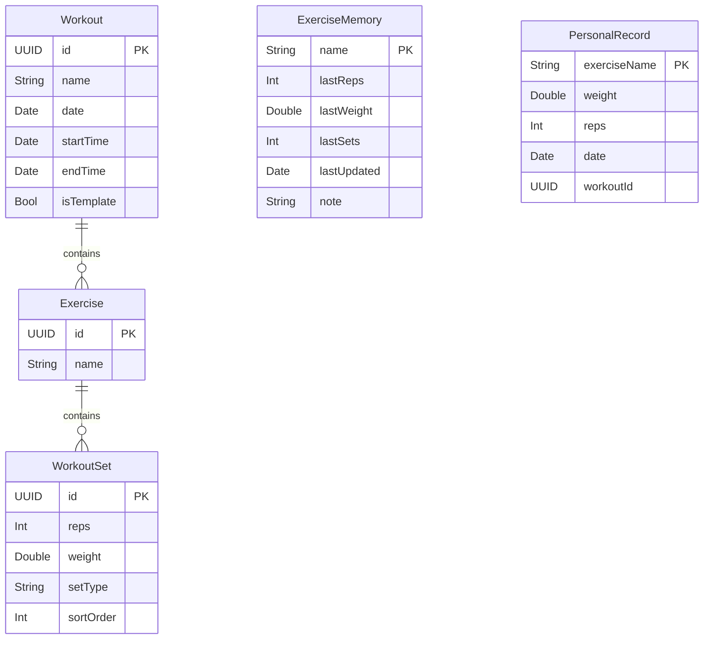
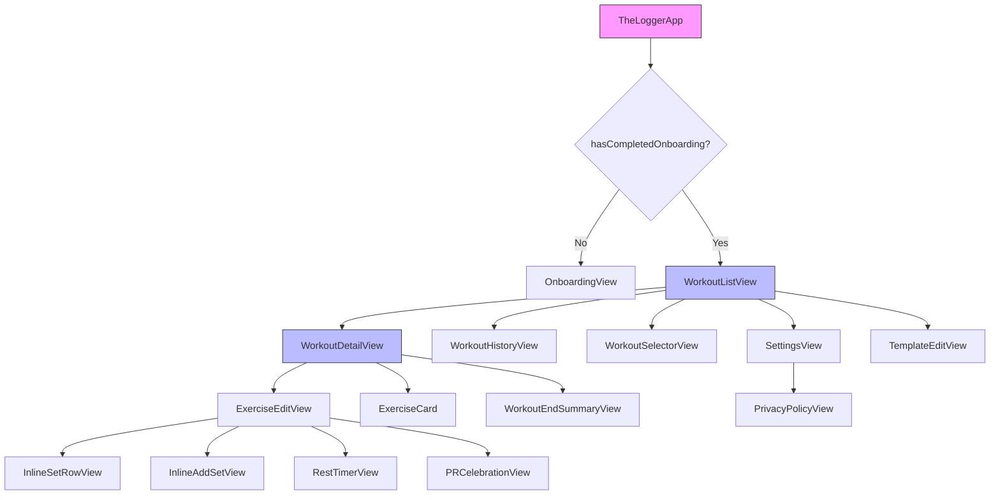
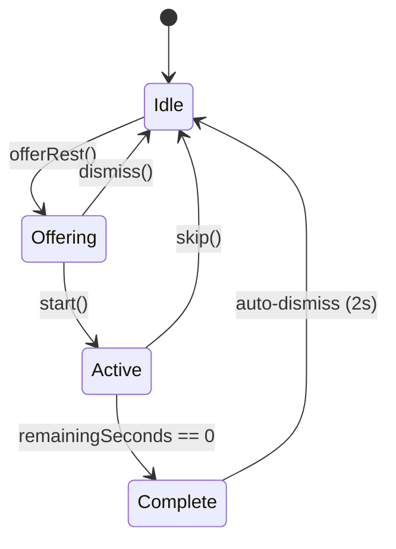
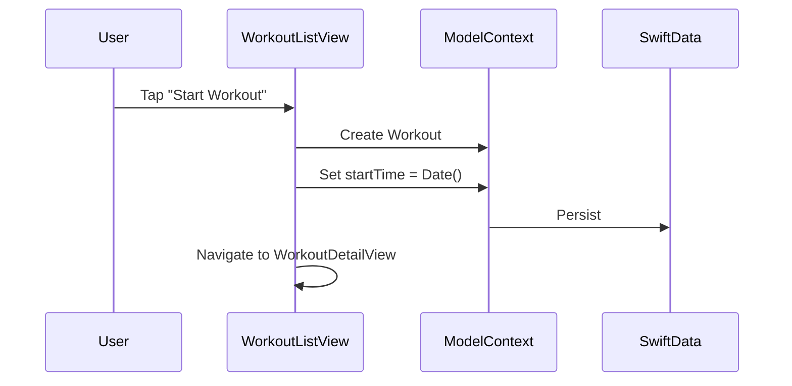
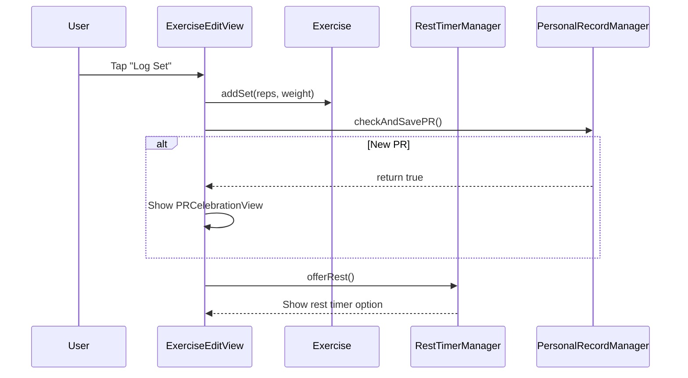

# TheLogger Architecture

This document describes the technical architecture of TheLogger, including data models, view hierarchy, and state management.

## Overview

TheLogger follows a modified MVVM pattern using SwiftUI and SwiftData:

- **Models**: SwiftData `@Model` classes handle persistence
- **Views**: SwiftUI views use `@Query` for reactive data fetching
- **ViewModels**: Minimal - most logic lives in models or views
- **Shared State**: `@Observable` singletons for cross-cutting concerns

## Data Model



### Model Relationships

| Parent | Child | Relationship | Delete Rule |
|--------|-------|--------------|-------------|
| Workout | Exercise | One-to-Many | Cascade |
| Exercise | WorkoutSet | One-to-Many | Cascade |

### Key Model Properties

**Workout**
- `isActive`: `startTime != nil && endTime == nil`
- `isCompleted`: `endTime != nil`
- `isTemplate`: Reusable workout structure

**WorkoutSet**
- `setType`: "Warmup" or "Working" (stored as String for SwiftData)
- `sortOrder`: Ensures consistent display order

## View Hierarchy



### Navigation Flow

1. **App Launch** → OnboardingView (first time) or WorkoutListView
2. **WorkoutListView** → Central hub for all navigation
3. **WorkoutDetailView** → Active workout editing
4. **ExerciseEditView** → Individual exercise with sets

### View Responsibilities

| View | File | Purpose |
|------|------|---------|
| TheLoggerApp | TheLoggerApp.swift | App entry, SwiftData container |
| OnboardingView | OnboardingView.swift | 3-screen welcome flow |
| WorkoutListView | WorkoutListView.swift | Home, templates, history |
| WorkoutDetailView | WorkoutDetailView.swift | Active workout editing |
| ExerciseEditView | ExerciseViews.swift | Exercise + sets editing |
| SettingsView | SettingsView.swift | User preferences |

## State Management

### SwiftData Queries

Views use `@Query` for reactive data:

```swift
// All workouts, most recent first
@Query(sort: \Workout.date, order: .reverse)
private var workouts: [Workout]

// Only templates
@Query(filter: #Predicate<Workout> { $0.isTemplate == true })
private var templates: [Workout]
```

### Model Binding

For editing SwiftData models in views:

```swift
struct ExerciseEditView: View {
    @Bindable var exercise: Exercise

    var body: some View {
        TextField("Name", text: $exercise.name)
    }
}
```

### Shared State: RestTimerManager



**RestTimerManager** is an `@Observable` singleton that manages:
- Timer state (active, remaining time, progress)
- Rest offer state (shows "Start Rest" button)
- Background handling (continues timing when app backgrounded)
- Haptic feedback on completion

### Environment Values

```swift
// Unit system passed through environment
@Environment(\.unitSystem) var unitSystem
```

## Data Flow

### Creating a Workout



### Logging a Set



## Component Architecture

### Reusable Components (Components.swift)

| Component | Purpose |
|-----------|---------|
| CardStyle | View modifier for consistent card backgrounds |
| AppFont | Centralized typography definitions |

### Animation Components (Animations.swift)

| Component | Purpose |
|-----------|---------|
| RingFillProgress | Circular progress with completion animation |
| SetCompletionRing | Mini ring for set indicators |
| LiquidWaveTimer | Animated liquid-fill timer |
| LiquidWaveBar | Horizontal progress bar with wave |
| WorkoutProgressRing | Overall workout completion ring |
| HapticWeightStepper | Weight adjustment with haptics |
| HapticRepsStepper | Reps adjustment with haptics |

## Business Logic

### Unit Conversion (UnitFormatter)

```
Storage: Always in lbs
Display: User's selected unit (lbs or kg)

convertToDisplay(lbs) → display unit
convertToStorage(display) → lbs
```

### PR Detection (PersonalRecordManager)

Uses Brzycki formula for estimated 1RM:
```
1RM = weight × (36 / (37 - reps))
```

Only working sets (not warmups) with weight > 0 and reps > 0 are considered.

### Exercise Library

Built-in database of ~70 common exercises organized by muscle group:
- Chest, Back, Shoulders, Arms, Legs, Core
- Each exercise marked as compound or isolation
- Compound exercises get longer default rest (120s vs 60s)

## File Organization

```
TheLogger/
├── App Entry
│   └── TheLoggerApp.swift        # @main, ModelContainer setup
├── Models
│   ├── Workout.swift             # Workout + all helpers
│   ├── Exercise.swift            # Exercise model
│   └── WorkoutSet.swift          # WorkoutSet model
├── Views
│   ├── WorkoutDetailView.swift   # Active workout editing
│   ├── WorkoutListView.swift     # Home + navigation
│   ├── ExerciseViews.swift       # ExerciseCard, ExerciseRowView, ExerciseEditView
│   ├── ExerciseSearchView.swift  # Exercise search/selection
│   ├── ExerciseDetailView.swift  # Exercise detail
│   ├── SetViews.swift            # InlineSetRowView, InlineAddSetView, AddSetView
│   ├── TemplateEditView.swift    # Template creation/editing
│   ├── TimerViews.swift          # RestTimerView, PRCelebrationView
│   ├── SummaryViews.swift        # WorkoutEndSummaryView
│   ├── SettingsView.swift        # Settings
│   ├── OnboardingView.swift      # Onboarding
│   ├── PrivacyPolicyView.swift   # Privacy policy
│   └── ContentView.swift         # AddWorkoutView (legacy, supporting views)
├── CameraRepCounter/             # Camera-based rep counting
├── Components
│   ├── Components.swift          # UI components
│   └── Animations.swift          # Animation components
└── Extensions
    ├── PRManager.swift           # PR detection logic
    └── LiveActivityManager.swift # Live Activity handling
```
